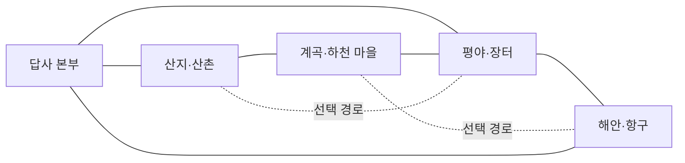

# 57. 등고선 지형 탐험대 — 아이디어 계획

- 작성일: 2026-10-06. 상태: **아이디어 계획**이며 구현하지 않았다.
- 요청 방향: 한 방향으로 달리는 코스보다 여러 지형을 자유롭게 돌아다니며 현장 체크리스트를 확인하고, 지역 환경에 맞는 활동을 하는 사회과 지리 맵.
- 선행 기준: [18. 전체 맵 게임성 분석](18-전체맵-게임성-분석.md), [19. 게임성 반영 기준](19-게임성-반영-기준.md). 이 문서는 기존 「유적 발굴 현장」의 연장이 아니라 별도의 새 맵 아이디어다.
- 교육과정 연결은 2022 개정 초등 사회과의 지리 성취기준을 찾아 2026-10-06에 추가했다. 학년군별 초점과 등고선의 지위를 2절에 적었다.
- 이름은 임시로 **「등고선 지형 탐험대」**라 한다. 학습 효과, 플레이 시간, 교실 반응은 확인하지 않았다.

## 1. 한 줄 콘셉트

탐험대가 현장 수첩의 체크리스트를 들고 산지·계곡·평야·해안 지형을 원하는 순서로 답사한다. 등고선과 주변 지형을 실제 공간에 대응해 읽고, 각 지역의 높낮이와 지형 모양에 맞게 길·다리·마을 연결을 계획한다.

핵심 재미는 **지도를 보고 실제 장소를 찾아가는 탐험**이다. 등고선을 읽는 일은 문 앞의 퀴즈가 아니라, 어디로 걷고 어떤 일을 할지 정하는 도구가 된다.

## 2. 학습 범위와 표현

### 2022 개정 사회과 지리 영역과의 연결

| 학년군·성취기준 | 교육과정에서 다루는 내용 | 맵에서 연결할 활동 |
|---|---|---|
| 3~4학년군 `[4사05-02]` | 지도에서 우리 지역의 위치를 파악하고 지리 정보를 탐색한다. 해설은 위치·면적·인구·지형·기온·강수량 같은 지역 정보를 살펴 다른 지역과 비교해 특징을 이해하는 데 초점을 둔다. | 지도 범례와 높이 표식을 보고 가상 지역의 지형 정보를 찾고, 본부 지도와 실제 지형을 대응시킨다. |
| 3~4학년군 `[4사10-01]` | 여러 지역의 자연환경·인문환경 특징을 살펴보고, 환경 이용과 개발에 따른 변화를 탐구한다. 해설은 개발의 긍정적·부정적 변화를 균형 있게 파악하도록 한다. | 지역마다 다른 길·다리·마을 연결을 계획하고, 길이 생기며 이동과 지역 연결이 어떻게 달라졌는지 활동 전후 지도로 비교한다. 선택 경로의 이득과 불편을 함께 보여 준다. |
| 5~6학년군 `[6사10-01]` | 세계 여러 지역의 지형 경관을 살펴보고 다양한 삶의 모습을 이해한다. | 산지·하천·평야·해안의 가상 사례를 통해 지형 경관에 따라 이동·정착 공간이 어떻게 달라지는지 비교하는 확장 방향으로 쓸 수 있다. |

**첫 버전은 3~4학년군, 특히 우리 지역 지리 정보 탐색을 중심으로 맞추는 편이 적절하다.** 5~6학년군 수준의 세계 여러 지역 비교는 확장 방향이다. 여기 적은 학년 제안은 맵 설계 판단이며 교과서 단원 순서나 교사의 수업 계획을 대신하지 않는다.

확인한 성취기준에는 **‘등고선 읽기’가 그 자체의 필수 항목으로 명시되어 있지 않다.** 등고선은 `[4사05-02]`의 지형 정보와 지도 탐색을 구체적으로 경험하게 하는 맵의 표현 방법으로 둔다. 따라서 선 간격 읽기만 훈련하고 끝내지 않고, 실제 지역 찾기·환경 비교·경로 선택과 연결한다.

- 등고선은 같은 높이의 지점을 이은 선이다. 지도에 표시된 등고선 간격이 같을 때 선이 가까우면 경사가 급하고, 멀면 완만하다.
- 닫힌 등고선은 언덕이나 봉우리 같은 지형의 모양을 보여 줄 수 있다. 지도 기호와 높이 숫자를 함께 보고 실제 모형 지형에서 위치를 찾는다.
- 계곡과 물길은 등고선 모양 및 파란 물길 표시를 함께 살펴본다. 첫 버전에서 V자 방향 규칙을 가르칠지는 교과 범위를 확인한 뒤 결정한다.
- 등고선만으로 토양의 비옥도, 홍수 위험, 실제 물의 깊이까지 알 수 있다고 표현하지 않는다. 그런 활동을 넣으려면 별도의 자료 표시와 근거를 둔다.
- 고도 차이와 등고선 간격은 게임용 지형 모형으로 단순화한다. 실제 지역의 축척·고도 측량 자료처럼 보이지 않도록 가상 지명과 범례를 쓴다.

## 3. 공간 구성과 이동

중앙의 **답사 본부**에서 넓은 지형 모형 지도를 보고 네 지역으로 갈 수 있다. 지역은 정해진 순서가 없고 여러 길이 서로 이어져 있어 한 곳을 다녀온 뒤 다른 지역으로 이동하거나, 이미 열린 길을 따라 돌아다닐 수 있다.

각 지역에는 작은 전망 지점, 실제 크기로 걸을 수 있는 지형, 현장 활동 장소를 둔다. 지도와 현장 사이를 오갈 때 등고선 위치·높이 표식·물길 같은 단서를 대응시킨다. 체크포인트는 본부와 지역별 안전 지점에 두어 탐험 중 떨어져도 가까운 곳에서 이어 간다.

### 중심 임무와 이동망

탐험대의 임무는 **흩어진 네 지역을 답사해 지역 사이를 잇는 생활 길 지도를 완성하는 것**이다. 산촌·하천 마을·평야 장터·해안 마을을 연결할 때 지형에 따라 걷기 쉬운 길과 필요한 다리가 달라진다. 네 활동을 마치면 본부의 지도 모형에 학생이 만든 연결망과 지역 표식이 모두 나타난다.

첫 이동망은 순환형으로 잡아 어느 지역을 먼저 가도 본부로 되돌아오거나 다음 지역으로 이어 갈 수 있게 한다. 지름길은 선택으로 두며, 지름길을 못 찾아도 기본 지역을 모두 답사할 수 있다.

이 구조는 제안 수준이다. 실제 맵에서는 각 연결 구간을 걸어 다니며, 평면 지도에서 고른 경로가 어떤 높낮이와 굴곡으로 이어지는지 확인한다.

| 지역 | 지도에서 살펴볼 단서 | 지역에 맞는 현장 활동 | 눈에 보이는 결과 |
|---|---|---|---|
| 산지 | 선이 촘촘한 급경사와 간격이 넓은 완경사, 봉우리 높이 | 산촌과 전망대를 잇는 길을 계획한다. 짧고 가파른 길과 길지만 완만한 등고선 길 중 선택한다. | 선택한 길에 계단 또는 완만한 산길이 놓이고, 산촌에서 전망대까지 실제로 걸어갈 수 있다. |
| 계곡·하천 | 주변보다 낮아지는 골짜기, 지형을 따라 이어지는 물길 | 양쪽 마을을 잇는 다리를 놓을 위치를 찾는다. 실제 지도에서 골짜기 폭과 접근 경사를 보고 고른다. | 선택한 위치에 다리가 생기며, 다리를 건너 다음 답사 지점으로 이동한다. 지도에서 다리 위치에 따라 연결되는 마을과 이동 경로를 비교한다. |
| 평야 | 넓게 벌어진 등고선과 고도 변화가 작은 구역 | 여러 마을과 장터를 연결하는 길의 경로를 정한다. 평탄한 지형을 따라 우회하는 길과 작은 언덕을 넘는 길을 비교한다. | 길이 연결되면 장터와 마을 사이를 돌아다닐 수 있고, 답사 지도에 연결선이 표시된다. |
| 해안 | 해안선과 낮은 지대, 해안 가까이의 높이 변화 | 항구·해안 마을을 잇는 이동 경로를 정하고, 지형 모형에서 해안의 굴곡을 따라 찾아간다. | 선택한 해안 길이나 전망 지점이 열리고, 본부 지도에 해안 답사 경로가 남는다. |

지역 활동은 지형 읽기와 사람들의 이동·생활 공간이 어떻게 연결되는지 탐색하는 사례다. 토지 이용의 정답을 한 가지로 정하지 않고, 활동에 필요한 조건을 지도 범례나 현장 표식으로 제공한다. 길을 내거나 다리를 놓은 결과는 이동이 편해지는 점과 다른 경로보다 길거나 불편한 점을 함께 보여 준다. 등고선 하나만으로 개발의 환경 영향을 단정하지 않는다.

## 4. 체크리스트와 플레이 흐름

현장 수첩은 한 항목을 **관찰 → 적용 → 확인** 흐름으로 보여 준다. 학생은 항목을 읽고 지정된 순서로 이동하는 대신, 본부 지도에서 관심 지역을 골라 떠난다. 현장에 도착하면 관찰 항목이 열리고, 지형을 살펴 선택한 활동이 완료되면 체크가 표시된다.

1. **관찰**: “선이 촘촘한 곳은 어디지?”, “지도에서 본 골짜기를 현장에서 찾을 수 있을까?”처럼 탐색 방향만 제시한다. 표식은 발견 지점을 알려 주기보다 관찰한 장소와 대응하는지 확인해 준다.
2. **적용**: 현장에서 본 지형에 맞춰 산길·다리·마을 연결 경로를 정하고 실제로 이동한다. 지도와 다른 경로를 시험해도 손해를 주지 않으며, 선택한 결과를 직접 걸어 확인할 수 있다.
3. **확인**: 새 길과 다리가 현장에 남고 본부 지도에도 기록된다. 수첩은 완료를 알려 주되, 정답 숫자나 다음에 갈 위치를 대신 알려 주지 않는다.

예상 가능한 탐험 순서는 여러 가지다. 산지 길을 먼저 만든 뒤 계곡 다리를 놓아 평야로 내려올 수도 있고, 본부에서 가까운 평야·해안을 먼저 둘러본 뒤 산지로 올라갈 수도 있다. 각 지역 활동은 독립적으로 시작되지만, 완료한 길이 다음 지역으로 갈 때 실제 이동 선택지를 늘린다.

| 수첩 항목 예시 | 학생이 하는 일 | 완료 뒤 달라지는 점 |
|---|---|---|
| 산지: 완만한 길과 급한 길을 비교해 산촌과 전망대를 잇기 | 지형 모형에서 등고선 간격을 확인하고 원하는 길을 걸어 본다. | 선택한 길이 나타난다. 완만한 길은 더 길지만 편히 걸을 수 있고, 짧은 급경사 길은 선택 도전으로 남는다. |
| 계곡: 하천 양쪽 마을을 연결할 지점을 찾기 | 양쪽 지형 높이와 계곡 폭을 살펴 다리 위치를 고른다. | 다리를 실제 이동 경로로 사용할 수 있고 지도에 위치가 기록된다. |
| 평야: 장터와 마을 사이의 연결길 만들기 | 평탄한 지형을 따르는 길과 언덕을 지나는 길을 비교해 걸어 본다. | 선택한 도로가 열려 장터와 마을, 다음 답사 구역을 연결한다. |
| 해안: 해안 마을과 항구 사이를 답사하기 | 해안선의 굴곡과 주변 높이를 살펴 해안 길 또는 언덕 전망 경로를 고른다. | 선택한 길이 해안 지형 위에 남아 본부 지도에 이어진다. |

첫 버전의 완주 목표는 네 지역의 기본 답사를 마치고 본부 지도에서 연결 결과를 확인하는 것으로 둔다. 항목 순서는 자유다. 짧은 지름길, 봉우리 전망점, 대안 경로 찾기는 선택 도전으로 두어 기본 완주를 막지 않는다. 잘못 고른 경로는 현장에서 바꾸거나 가까운 본부·지역 체크포인트에서 다시 시작한다. 발판을 여러 번 밟아 상태를 바꾸는 방식과 강제 왕복은 피한다.

완주 뒤에는 학생이 고른 길을 지도 모형에서 다시 보거나, 아직 방문하지 않은 전망 지점·대안 경로를 자유롭게 살펴볼 수 있다. 첫 버전은 **첫 체험용 탐험 맵**으로 삼고, 시드 위치만 바꾸는 재플레이는 제공하지 않는다.

## 5. 게임성 점검표 초안 (docs/19 적용)

| 항목 | 이 아이디어의 기준 |
|---|---|
| 핵심 재미 | 현장 수첩을 들고 여러 지형을 찾아다니며 지도와 실제 공간을 맞춰 보는 탐험 |
| 의미 있는 선택 | 등고선 간격·높이·물길을 보고 길과 시설 위치를 선택하며, 각 선택의 이동 결과가 다름 |
| 즉시 결과 | 길·다리·답사 표식이 현장에 생기고 본부 지도에도 기록됨 |
| 다음 행동·성취 | 만든 길을 직접 걸어 다음 지형으로 이동하고, 답사한 지역들이 본부의 연결 지도로 완성됨 |
| 구간 변화 | 산지의 경사 경로, 계곡의 연결 지점, 평야의 연결망, 해안의 경로 탐색으로 행동이 달라짐 |
| 재시도 부담 | 체크포인트에서 가까운 현장으로 복귀, 길 선택은 현장에서 다시 계획, 긴 왕복·강제 대기 없음 |
| 기본 완주·선택 도전 | 네 지역의 기본 답사는 완주 목표, 지름길·전망점·추가 경로 탐색은 실제로 건너뛸 수 있는 별도 도전 |
| 친구와의 연결 | 서로 다른 지형 단서를 알려 주고 경로 선택 이유를 설명할 수 있음. 필수 역할 분담이나 동시 조작은 없음 |
| 재체험 용도 | 첫 버전은 지도와 지형 대응을 익히는 첫 체험. 후속 재체험은 답사 목표·연결 경로를 바꿀 때만 추가 |
| 근거·관찰 | 현재는 설계 아이디어. 코드·봇·교사·교실 검증 모두 없음 |

## 6. 구현 전 결정할 질문

- 대상 학년과 사회과 교육과정의 범위를 확인해 등고선 읽기에 더해 축척·방향·하천 지형을 포함할지 정한다.
- 계곡의 물길 방향 같은 추가 개념은 학년 적합성을 확인한 뒤 선택한다. 첫 버전은 경사 비교와 지도·현장 대응을 중심으로 둔다.
- 모든 구간을 걷기로 연결할지, 나룻배 같은 선택 이동 수단을 추가할지 정한다. 타이밍·정밀 조작을 기본 길에 요구하지 않는다.
- 시드에 따라 지형 모양과 활동 위치를 바꾸는 것은 첫 버전에서 제외한다. 기본 지도가 읽히는지 확인한 뒤 재체험 가치가 필요할 때만 검토한다.

확정된 첫 버전 구조는 **네 지역의 기본 활동을 모두 체크하되 순서는 자유로운 순환형 이동망**이다. 네 가지 활동 자체가 반복되지 않도록 답사·경로 선택·연결 작업의 비중을 조정한다.

## 7. 교실에서 관찰할 장면

- 학생이 본부 지도를 들여다본 뒤 실제 지형으로 이동해 해당 장소를 찾는가.
- 등고선 간격과 높이 숫자를 어떤 경로를 고르는 데 사용하는가. 지도만 보고 외운 답을 고르는지, 현장 지형을 확인하는지도 본다.
- 체크리스트가 다음 탐험 장소를 스스로 정하게 돕는가, 해야 할 일이 많다는 부담을 주는가.
- 지역마다 활동 방법이 다르다고 느끼는가, 모든 곳을 같은 표식 찾기로 받아들이는가.
- 선택한 길·다리가 만들어진 뒤 실제로 그 결과를 이동에 활용하는가.
- 먼저 끝난 학생이 추가 지역을 탐험하거나 친구에게 지도를 설명하는가. 기다리거나 강제로 돕게 하지 않는다.
- 낙하·잘못된 선택 뒤 가까운 곳에서 다시 시작하는가, 본부까지 긴 왕복이 생기는가.

위 항목은 향후 관찰 제안이며 학생 반응이나 학습 효과의 증거가 아니다. 현재는 맵 구현과 시험을 하지 않았다.

## 8. 첫 버전의 범위와 보류 항목

첫 구현은 가상 지역 네 곳, 지역별 기본 활동 한 가지, 대안 경로 한 가지, 현장 수첩과 본부 지도를 보여 주는 범위로 제한한다. 기후·산업·인구 분포·토양 등 여러 사회과 주제를 한꺼번에 설명하지 않는다. 등고선 간격을 보고 경사를 비교하고, 지형과 이동·시설 배치를 연결하는 체험을 먼저 확인한다.

다음은 첫 버전에서 보류한다.

- 실제 지역·유산을 사실적으로 재현하고 지명·역사 정보를 많이 넣는 확장
- 등고선에서 토양·홍수·농업 생산성을 직접 추정하는 활동
- 팀별 역할이나 동시 발판 조작이 필요한 협동
- 시간 제한, 길을 잘못 골랐을 때의 낙하·긴 복귀
- 학생이 지도를 직접 그리거나 시설을 자유 배치하는 편집 도구
- 교과 학년과 범위가 확인되기 전의 축척 계산, 정확한 고도 측정, 복잡한 등고선 해석

첫 교사 시험에서는 체크리스트가 탐험을 돕는지, 활동이 네 지역에서 충분히 다르게 느껴지는지 확인한 뒤 범위를 넓힌다.

## 참고 근거

- 미국 지질조사국은 등고선을 같은 고도의 지점을 잇는 선으로 설명하고, 간격이 촘촘하면 급경사, 넓으면 비교적 평탄한 지형을 나타낸다고 안내한다: [USGS 지도 기호 안내](https://www.usgs.gov/ngp-standards-and-specifications/100k-ondemand-topo-cartographic-specifications-map-symbol-guide), [USGS 지형도 설명](https://pubs.usgs.gov/publication/fs07999).
- 교육과정 근거: [NCIC 2022 개정 교육과정 고시 안내](https://ncic.go.kr/board/B0031.cs?act=read&bwrId=1271&pageIndex=1&pageUnit=15), [국립특수교육원 2022 개정 초등 사회과 자료](https://www.nise.go.kr/ebook/src/viewer/download.php?host=main&no=1&site=20240819_172144)(`[4사10-01]` 및 해설), [교육과정평가연구의 5~6학년 지리 성취기준 표](https://www.ejce.org/archive/view_article?pid=jce-27-4-1)(`[6사10-01]`). `[4사05-02]`의 해설 및 `[4사10-01]`의 지역 환경 비교는 [한국지리환경교육학회지 관련 분석](https://journal.kgeography.or.kr/articles/xml/4a0x/)과 대조했다.
- 이 문서의 네 지역 활동과 게임 흐름은 프로젝트에 맞춘 설계 제안이다. USGS의 지형도 안내가 해당 게임 활동의 학습 효과를 검증한 것은 아니다.
