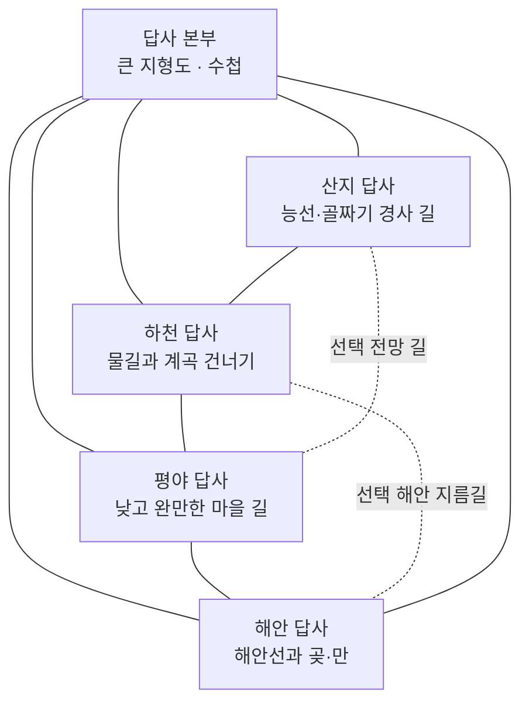

# 58. 등고선 지형 탐험대 — 맵 제작 계획서

- 작성일: 2026-10-06. 상태: **구현 완료**. 초기 제작 계획과 검토 제안은 당시 기록으로 보존하고, 확정 내용·현재 동작·시험 결과는 [59. 제작 기록](59-등고선-지형탐험대-제작.md)을 기준으로 본다.
- 아이디어 근거: [57. 등고선 지형 탐험대 아이디어](57-등고선-지형탐험대-아이디어.md), [18. 전체 맵 게임성 분석](18-전체맵-게임성-분석.md), [19. 게임성 반영 기준](19-게임성-반영-기준.md), [22. 교육 내용 점검](22-교육내용-점검.md).
- 교육과정 초점: 5학년 1학기 예시 단원 `우리나라 국토여행`, 성취기준 `[6사01-01]` — 우리나라 산지·하천·해안 지형의 위치와 분포 특징 탐구. 계획 예시의 학년 배치는 지역별 수업 운영을 보장하지 않으므로 학교 계획과 대조한다.
- **구현 전 [10절 검토 반영안](#10-검토-반영안-2026-10-06-claude-제안)을 먼저 읽는다.** 2~4절의 구역 구성·연결 규칙과 충돌하면 10절을 따르되, Codex가 구현 시작 전에 확정한다.
- 구현 시 새 맵 제작은 Codex가 맡는다. 구현 기록은 **`docs/59-등고선-지형탐험대-제작.md`**에 남긴다.

## 0. 제작 목표와 범위

학생이 답사 본부의 지형도와 현장 지형을 오가며 우리나라 산지·하천·해안 지형의 위치와 분포를 조사한다. 학생은 현장 수첩에서 할 일을 확인하고 방문 순서를 정한다. 현장에서 본 등고선·높이 표식·물길·해안선을 지도와 대응하고, 지형에 맞는 답사 활동을 마치면 본부 지도에 관찰 결과가 남는다.

첫 버전의 정체성은 **자유 순서로 공간을 찾아다니는 현장 답사**다. 앞으로만 달리는 코스, 문 앞 퀴즈, 반복 발판 조작을 중심으로 만들지 않는다. 지도에서 정답을 누르면 통과하는 구조도 쓰지 않는다. 지형 단서를 읽은 뒤 그 장소까지 직접 이동하고, 지역마다 다른 행동으로 확인한다.

- 기본 목표: 산지·하천·평야·해안 네 구역의 필수 답사를 원하는 순서로 마치고 본부 지형도에서 분포를 확인한다.
- 교육 초점: 산지·하천·해안의 위치와 분포. 평야 구역은 하천 주변의 낮고 완만한 지형을 비교하는 보조 사례로 둔다.
- 플레이 목표: 선택한 구역의 활동 결과를 다음 이동에 사용하고, 방문 완료 표식이 본부의 지형 분포도에 누적된다.
- 길이 목표: 기본 답사 이동의 대표 동선 약 170~220m. 직선 진행 거리가 아니라 자유 이동망의 주요 경로를 측정한다.
- 첫 버전은 가상 지명과 단순화한 지형 모형을 쓰되, 지형 구역의 상대적 위치는 우리나라 지형 분포를 반영한다. 구체적인 지명·사례·배치는 구현 전 공신력 있는 지리 자료와 교과 자료로 확인한다.

## 1. 학습 내용과 표현 원칙

1. 본부 지도에서 산지·하천·해안 기호와 범례를 읽고 각 지형이 놓인 위치를 찾는다.
2. 현장 지형에서 등고선 간격·높이 숫자·물길·해안선을 살펴 지도와 실제 공간을 대응한다.
3. 네 구역에서 얻은 관찰 표식을 지도에 모아 분포의 공통점과 차이를 설명할 수 있게 한다.

**등고선 읽기 자체를 성취기준이라고 소개하지 않는다.** 등고선은 `[6사01-01]`의 위치·분포 탐구를 돕는 지도 표현이다. 같은 등고선 간격 체계에서 선이 촘촘한 곳은 경사가 급하고 간격이 넓은 곳은 완만하다는 정도를 현장 경로 선택에 쓴다. 등고선만으로 토양, 홍수 위험, 농업 생산성, 물의 깊이를 추정하지 않는다.

- 교육과정 코드의 `6사`는 5~6학년군 코드다. 경기도교육청 2026년 계획 예시는 해당 성취기준을 5학년 1학기 `우리나라 국토여행`에 배치한다. 다른 교육청·학교·교과서의 순서를 동일하다고 단정하지 않는다.
- 기후·자연재해·인구 분포를 다루는 `[6사02-01]`, `[6사02-02]`는 후속 맵 확장 후보이며 첫 버전의 학습 목표에 넣지 않는다.
- 실제 지형을 축척에 맞춰 재현한 지도처럼 보이지 않게 `답사용 모형 지도`임을 표기한다. 범례, 높이 단위, 단순화 범위를 함께 안내한다.
- 맞는 활동 결과는 지형을 설명하는 짧은 문장과 시각 표식으로 보여 준다. 정확한 정답 숫자를 외워 입력하게 만들지 않는다.

## 2. 핵심 플레이와 맵 구조

본부에는 큰 지형도, 현장 수첩, 각 구역으로 이어지는 여러 길을 둔다. 학생은 본부에서 어느 구역으로 갈지 고르고, 각 구역의 관찰 지점에서 지형 단서를 현장 모형과 대조한다. 활동을 마치면 해당 지형 표식이 수첩과 본부 지도에 기록된다. 완료한 활동의 결과는 지도상 이동 연결 또는 현장 경로에 반영되어 다음 답사의 길 선택을 바꾼다.

지역을 다녀온 뒤 같은 장소로 돌아가 상태를 다시 켜는 왕복은 만들지 않는다. 기본 이동망은 순환하며, 활동 결과가 다음 구역의 길을 열거나 짧게 연결한다. 체크포인트는 본부와 지역별 안전 지점에 두고, 낙하 뒤 해당 구역의 활동 상태와 수첩을 유지한다.

### 구역별 활동 계획

| 구역 | 관찰 단서와 학생 행동 | 지역에 맞는 활동 | 결과가 쓰이는 다음 행동 |
|---|---|---|---|
| 산지 | 본부 지도에서 산지 기호를 찾고, 현장에서 등고선 간격과 봉우리·능선 모양을 대조한다. | 산촌과 전망 지점을 잇는 길을 답사한다. 급하지만 짧은 능선 길과 완만하지만 돌아가는 등고선 길 중 선택한다. 두 길 모두 기본 완주 경로에 연결된다. | 선택한 길 모양이 현장에 남고, 전망 지점에서 확인한 산지 표식이 본부 지도에 추가된다. 완만한 길은 이후 지역 연결에 유리하고, 능선 길은 선택 전망점에 가깝다. |
| 하천·계곡 | 지도에서 물길이 지나는 위치를 찾고 현장에서 계곡의 낮은 부분과 하천 방향을 대조한다. | 마을 사이를 잇는 기존 다리 또는 얕은 건넘길을 찾아 이동한다. 통과 방법에 따라 짧은 계곡길과 편한 우회 길 중 고른다. | 고른 연결이 다음 평야·해안 구역의 진입로가 된다. 하천 표식과 연결 위치가 본부 지도에 남는다. 실제 수심·홍수 안전을 등고선만으로 판정하지 않는다. |
| 평야 | 주변보다 고도 변화가 작고 등고선 간격이 넓은 곳을 찾아 현장 지형과 대조한다. | 마을과 장터를 잇는 평탄한 길을 걷고, 작은 언덕을 가로지르는 짧은 전망 우회로를 선택적으로 둘러본다. | 평야 답사를 완료하면 장터 길이 열려 다음 구역으로 건너갈 수 있다. 넓은 평탄지 표식이 지도에 누적된다. |
| 해안 | 본부 지도에서 해안의 굴곡을 찾고, 현장에서 곶·만과 주변 높낮이를 비교한다. | 해안선을 따라 항구와 해안 마을을 답사한다. 낮고 굽은 해안길 또는 조금 높은 전망길을 고른다. 기본 길은 점프 없이 통과한다. | 선택한 해안길이 본부와 산지/평야 중 한 연결로 이어진다. 해안 표식과 관찰한 굴곡이 지도에 기록된다. |

활동마다 다른 움직임이 핵심이다: 산지는 경사를 따라 걷기, 하천은 건널 지점을 찾아 이동하기, 평야는 넓은 연결망을 가로지르기, 해안은 굴곡을 따라 위치를 찾기다. 같은 조사 발판을 네 곳에 복제하는 방식은 피한다.

## 3. 수첩·지도 상태와 선택 결과

- 현장 수첩은 완료 여부와 관찰 주제를 알려 주되, 정답 위치를 바로 표시하지 않는다. 힌트는 “선이 더 촘촘한 산비탈은 어느 쪽인가?”처럼 찾을 단서만 제시한다.
- 본부 지도는 시작 때 주요 지형 기호와 현 위치를 제공한다. 답사한 지역은 관찰 표식과 학생이 지나간 연결로가 순차적으로 나타난다.
- 수첩 항목은 학생별 상태로 관리한다. 다른 학생의 이동이 내 수첩·길 상태를 바꾸지 않는다.
- 길 선택의 이득과 대가는 이동 방식이나 접근 가능한 선택 지점으로 드러낸다. 단순히 한 길을 더 길게 걸리게 하거나 기다리게 하는 비용은 쓰지 않는다.
- 관찰·선택을 잘못해도 활동을 잠그지 않는다. 근처에서 다시 관찰하거나 다른 길로 바꿀 수 있고, 초기화 없이 수정할 수 있다.
- 네 구역의 기본 답사는 완주 조건으로 명확히 안내한다. 전망대, 추가 우회로, 별은 건너뛰어도 완주에 영향이 없는 선택 도전이다.
- 마지막에는 지형도에 네 구역의 표식과 연결망이 완성된다. 학생은 현장 기록과 전체 지도에서 본 지형 분포를 함께 확인한다.

## 4. 이동·안전·분량 기준

- 기본 답사는 약 170~220m 범위로 잡고, 여러 순서의 대표 동선을 재서 지나치게 긴 복귀가 없는지 확인한다.
- 체크포인트는 본부와 네 답사 구역에 최소 한 곳씩 두며, 이동 중 긴 구간에 추가 지점을 둔다. 부활 위치를 탄성 발판·움직이는 장애물·바람과 겹치지 않는다.
- 걸어서 올라서는 턱은 약 0.15m로 둔다. 기본 길에 정밀 점프, 타이밍, 좁은 발판을 요구하지 않는다.
- 기본 길은 폭과 바닥을 넉넉하게 하고 탈락·시간제한·밀치기·잡기를 두지 않는다. 학생끼리 서로 돕는 것은 자발적인 안내로 가능하게 한다.
- 등고선 경사를 보여 줄 시각 단서는 충분히 크고 대비가 있어야 한다. 장식 메시의 scale을 바꿀 때 충돌 상자도 함께 바뀌지 않도록 충돌체와 장식 메시를 분리한다.
- 조작 발판이 필요한 경우 밟는 동안 매 프레임 반복 반응하지 않게 하고, 올라서는 순간 1회 반응 후 일정 거리 벗어나야 재작동하도록 한다.
- 떨어지면 가까운 체크포인트에서 재개하고 수첩과 현장 활동 상태를 유지한다. 본부에서 처음부터 다시 걷게 하지 않는다.

## 5. 코드·파일 범위와 확장 지점

구현 시 예상 파일은 `prototype/src/levels/terrainexpedition.js`, `prototype/src/levels/index.js` 등록, `prototype/tests/terrainexpedition.mjs`, 제작 기록 `docs/59-등고선-지형탐험대-제작.md`다. 맵 id와 파일명은 구현 시작 전에 중복을 확인한다.

- 공용 파일(`kit.js`, `physics.js`, `player.js`, `main.js`, Firebase 규칙)은 기본 범위에서 바꾸지 않는다. 바꿔야 하면 변경 범위와 기존 맵 호환 영향을 먼저 기록한다.
- `kit.js`의 지형 블록·플랫폼·체크포인트·안내판·완주 패드 등 이미 있는 요소를 우선 재사용하고, 지도 표식은 맵 고유 시각 체계로 만든다.
- 게임 상태에 현재 위치, 수첩 완료 항목, 관찰 표식, 개방된 연결로를 노출해 맵별 시험이 실제 걷기 흐름을 확인할 수 있게 한다.
- 맵 메타데이터는 사회과 지리 분류로 등록한다. 새 맵을 등록하는 같은 변경에서 루트 `README.md`의 현재 구현 맵 표, `prototype/README.md` 표, `docs/55-맵-문서-색인.md`의 맵 행과 계획 문서 목록을 갱신한다.
- 폴 가이즈 연결은 분위기를 베끼지 않고 라운드 구조에서만 참고한다. 여러 출발점에서 갈림길을 고르고 루프를 탐색하는 라운드 후보와 비교하되, 이 맵의 중심인 지도·현장 대응과 지형 답사 플레이를 보존한다.

## 6. 맵별 시험 계획과 사람의 설계 확인

구현 때 `prototype/tests/terrainexpedition.mjs`에서 봇이 `run(...)`으로 실제로 걷게 한다. 맵 함수를 직접 불러 상태만 바꾸는 시험으로 걷기 가능성을 대신하지 않는다.

걷기 시험에 넣을 흐름:

1. 산지→하천→평야→해안 순으로 기본 답사를 모두 마치고 완주한다.
2. 해안→평야→산지→하천처럼 다른 순서로 답사하고 완주한다.
3. 각 구역의 기본 경로와 선택 경로가 의도대로 연결되는지 확인한다. 선택 경로를 건너뛰어도 완주한다.
4. 잘못 들어선 길이나 선택을 근처에서 수정하고, 낙하 뒤 수첩·표식이 유지되는지 확인한다.
5. 현장 체크포인트에서 2초 대기해 안전하게 머무는지 확인한다.
6. 지도에 표시된 각 지형 위치를 현장에서 찾아 수첩에 기록하는 흐름이 가능한지, 완성 지도 표식이 실제로 달라지는지 확인한다.
7. 복수 시드가 있다면 학생이 위치를 외우지 않아도 지도 단서로 찾을 수 있게 위치·단서를 함께 바꾸는지 확인한다. 첫 버전에 시드 변화가 없다면 고정 지도 첫 체험용이라고 기록한다.

공통 규칙·메타데이터 시험을 포함한 `prototype`의 `npm test`를 실행한다. 자동 시험은 규칙·이동 가능성만 증명하며 재미·수업 효과를 입증하지 않는다.

사람이 설계 확인란에 기록할 내용:

- [ ] 올바른 지형 단서를 보면 기본 이동이 분명해지는가.
- [ ] 경로 선택마다 이득과 대가가 있고, 더 긴 왕복·대기만 선택 비용으로 두지 않았는가.
- [ ] 현장 활동의 결과가 실제 다음 이동이나 지도 완성에 쓰이는가.
- [ ] 지역마다 핵심 행동이 달라, 발판 조작이나 표식 찾기의 반복처럼 느껴지지 않는가.
- [ ] 지도에 답이 그대로 나와 있지 않으며, 현장을 방문해 확인할 이유가 있는가.
- [ ] 기본 답사는 약 150~250m 안에서 여러 순서로 완주 가능하고, 복귀 부담이 적은가.
- [ ] 선택 활동은 실제로 건너뛸 수 있으며, 선택 별은 10개 이하인가.

## 7. 교사·교실 관찰 계획

첫 교사 시연과 학생 수업 관찰은 자동 시험과 분리해 기록한다. 교사 보고, 코드·봇에서 확인한 사실, 실제 교실 관찰을 섞지 않는다.

- 학생이 본부 지도를 보고 스스로 다음 답사 구역을 고르는가.
- 지도 기호·등고선 단서와 현장 지형을 대조하는가, 아니면 수첩 글자만 따라가는가.
- 산지·하천·평야·해안의 활동을 서로 다른 지형 경험으로 설명하는가.
- 방문 순서가 자유롭다는 점이 탐험을 돕는가, 어디부터 할지 혼란을 주는가.
- 선택한 길의 결과를 다음 지역으로 가는 데 사용하고 본부 지도에서 분포를 다시 보는가.
- 잘못된 선택·낙하 뒤 재시도 부담이 적고 가까운 곳에서 이어 가는가.
- 먼저 완료한 학생이 자발적으로 다른 구역을 탐험하거나 친구에게 지도를 설명하는가.

교실 시험 전까지 학습 효과·재미·수업 적합성은 **미검증**으로 기록한다.

## 8. 제작 기록 `docs/59`에 남길 항목

- 현재 맵 동작 요약, 변경 이력, 발전 방향
- 교육과정 기준과 수업 자료의 범위·한계
- docs/19 점검표와 기존 맵과의 실제 행동 차이
- 구역별 선택의 이득·대가, 결과가 다음 이동에 쓰이는 방식
- 낙하·오선택별 체크포인트와 복귀 부담
- 길이, 기본·선택 경로, 수첩·지도 상태 규칙
- 자동 시험 결과와 설계상 사람 확인 결과를 분리한 기록
- 교사 보고 및 실제 교실에서 관찰할 항목, 미확인 목록
- 이 계획과 구현의 차이 및 변경 이유

## 9. 완성 기준

- [ ] 5학년 `[6사01-01]`의 지형 위치·분포 탐구가 핵심 활동에 드러난다.
- [ ] 네 구역을 원하는 순서로 방문하고 기본 답사를 모두 마칠 수 있다.
- [ ] 지도와 실제 지형을 대응시키며, 구역마다 핵심 행동이 다르다.
- [ ] 관찰 결과가 수첩·본부 지도에 남고 이후 이동에 쓰인다.
- [ ] 선택마다 의미 있는 이득과 대가가 있으며 기본 완주는 안전하고 안정적이다.
- [ ] 대표 기본 동선 길이는 약 170~220m이고 체크포인트 복귀에 긴 왕복이 없다.
- [ ] 선택 도전은 실제로 건너뛸 수 있고 별은 10개 이하이다.
- [ ] 맵별 걷기 시험과 전체 `npm test`가 통과한다.
- [ ] 루트 README, `prototype/README.md`, docs/55 색인을 맵 등록과 같은 변경에서 갱신한다.
- [ ] 제작 기록에 docs/19 점검표, 사람의 설계 확인, 미확인 항목과 교실 관찰 계획을 남긴다.

## 10. 검토 반영안 (2026-10-06, Claude 제안)

2~9절을 점검해 찾은 문제와 고치는 방향이다. **제안**이며 구현 전에 Codex·사용자가 확정한다. 확정되면 2~4절 표와 9절 기준을 이에 맞춰 고친다.

### 10.1 자유 순서와 결과 사용을 함께 지키기

문제: 본부에서 네 구역으로 모두 직접 갈 수 있으면 결과가 없어도 완주해, "결과가 다음 이동에 쓰인다"가 형식이 된다.

- **본부 직통 입구는 세 곳**(산지·하천·해안)만 처음부터 열린다. **평야 입구는 닫혀 있고**, 산지 또는 하천 답사에서 만든 연결이 연다.
- 산지에서 만든 길은 평야의 **북쪽 언덕 입구**를, 하천에서 고른 건넘길은 **강가 입구**를 연다. 어느 쪽으로 열어도 평야 답사는 같고, 입구 위치와 첫 풍경이 달라진다(다른 해결 방법).
- 해안 답사 결과는 **본부로 돌아오는 지름길**(선택)을 연다. 기본 완주에는 필요 없다.
- 구분 규칙: 완주에 필요한 연결은 안내판에 "길이 열려요"로, 선택 지름길은 "지름길(건너뛰어도 돼요)"로 표시한다.
- 걷기 시험(6절)의 순서 시험을 바꾼다: 산지→하천→평야→해안, 하천→평야→해안→산지, 해안→산지→평야→하천을 걷고, **평야 입구가 닫힌 채로는 평야에 못 들어가고** 두 결과 중 어느 쪽으로든 열림을 확인한다. 기존 2번(해안→평야→산지→하천)은 불가능한 순서이므로 지운다.

### 10.2 평야 구역의 판단 보강

문제: 평탄한 길을 걷기만 해서 판단이 없다.

- 평야에서 **두 개의 후보 장터 터**를 지도(등고선 간격·고도 표식)로 비교해 마을 길을 이을 곳을 고른다(선택마다 이득과 대가: 평탄한 터는 길이 곧고 넓은 대신 강에서 멀거나 가깝다는 식의 **가상 설정**. 실제 입지 정답처럼 쓰지 않는다).
- 단순히 걷는 구간만 남으면 평야를 **하천 구역의 하류**로 합쳐 3구역 구조로 줄이는 안을 함께 검토한다. 평야는 성취기준 `[6사01-01]`의 직접 대상이 아니라 보조 사례이므로, 합치는 쪽이 범위에 더 맞는다.

### 10.3 분포 학습을 구역 구성에 넣기

문제: 구역이 한 곳씩이라 위치 관계와 지역 차이를 비교할 활동이 없다.

- 본부 지도에 **방위(동·서·남·북)**를 표시하고 구역 배치에 반영한다. 예: 산지는 지도의 한쪽(동·북)에 높게 모이고 다른 쪽은 낮다.
- **해안을 두 곳**(굴곡이 단조롭고 바로 깊어지는 해안 / 굴곡이 많고 낮은 해안)으로 나누어, 하나는 필수, 다른 하나는 선택으로 둔다. 두 곳을 모두 다녀오면 본부 지도에서 해안 차이를 비교하는 표식이 완성된다(선택 도전).
- 구체 지명·방위·실제 분포는 구현 전 공신력 있는 지리 자료로 확인한 뒤 가상 지명으로 단순화한다(0절). 이 절의 배치는 구조 예시이며 실제 분포가 아니다.

### 10.4 성취기준 확인

- `[6사01-01]`의 원문과 5학년 1학기 단원 배치는 이 문서 작성자가 원문으로 확인하지 못했다(57은 경기도교육청 계획 예시를 근거로 함). **구현 시작 전에 국가교육과정정보센터 원문과 대조**하고 결과를 59번 제작 기록에 쓴다. 다르면 1절·0절의 성취기준 표기를 고친다.

### 10.5 사소한 정리

- 산지 표의 "완만한 길은 이후 지역 연결에 유리"를 다음으로 고친다: **완만한 길은 평야 북쪽 언덕 입구를 열고(경사가 낮아 걷기 편함), 능선 길은 전망 지점과 선택 별에 가깝다. 두 길 모두 평야 입구를 연다.**
- 2절 이동망 그림과 57번 그림이 다르다. 58의 그림(본부 중심 + 순환)을 기준으로 하고 10.1을 반영해 평야 입구를 점선(결과로 열림)으로 고친다. 57번은 아이디어 보존용이라 그대로 둔다.
- 10.1~10.3을 반영해도 기본 대표 동선 길이는 170~220m 안에 있어야 한다. 해안 두 곳 때문에 늘면 선택 해안을 짧은 전망 길로 줄인다.

### 10.6 docs/19 점검 요약 (계획 단계, 모두 미검증)

| 항목 | 반영안의 내용 |
|---|---|
| 핵심 행동 | 지도·현장 대조로 구역을 고르고 길을 만든다 |
| 선택 결과 | 만든 길이 평야 입구를 열고, 입구 위치·풍경이 달라진다 |
| 결과의 활용 | 열린 입구로 평야에 들어가고, 해안 지름길로 본부에 돌아온다 |
| 재체험 | 다른 입구(산지 길/하천 길)로 평야에 들어가 보기, 다른 해안 비교. 첫 체험은 고정 지도(시드 변화 없음)임을 59에 명시 |
| 교실에서 볼 것 | 본부에서 닫힌 평야 입구를 보고 어디서 열릴지 찾는지, 해안 두 곳 비교를 하는지 |

